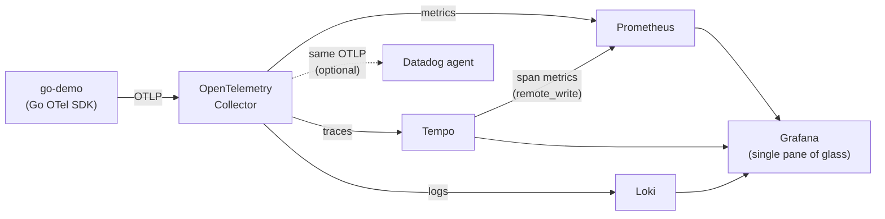

# Observability Lab

[](https://github.com/italo-gouveia/observability-lab/actions/workflows/ci.yml)
[](LICENSE)

A self-hosted, Docker-based observability platform built as a **learnable journey**.
Each level is a self-contained, runnable milestone — stop at any one and you already
have a strong project. The foundation is **OpenTelemetry**: a single instrumentation
standard whose telemetry fans out to open-source and commercial backends without
touching application code.

> **N0 (this level) is done and runs locally with one command.** Higher levels are the
> roadmap — see [The journey](#the-journey).

---

## N0 — Core (current)

A minimal Go service emits **traces, metrics, and logs** over OTLP to an OpenTelemetry
Collector, which routes each signal to its backend. Grafana ships pre-provisioned with
all three datasources wired together (trace ↔ log ↔ metric correlation).



The app drives itself with synthetic load, so dashboards populate on boot — no manual
`curl` needed. Tempo's metrics-generator derives RED metrics and service graphs from the
spans, written back to Prometheus.

### Run it

```bash
docker compose up --build
```

| Service    | Has a web UI? | Where to open it                                                        |
|------------|---------------|------------------------------------------------------------------------|
| Grafana    | ✅ yes        | http://localhost:3000 — anonymous admin; the N0 dashboard auto-loads   |
| Prometheus | ✅ yes        | http://localhost:9090 — targets under **Status → Targets**             |
| Demo app   | — (endpoints) | http://localhost:8080/work (manual hit) · `/healthz` (probe)           |
| Tempo      | ❌ no UI      | traces backend — **query via Grafana → Explore → Tempo** (TraceQL)     |
| Loki       | ❌ no UI      | logs backend — **query via Grafana → Explore → Loki** (LogQL)          |

> **Tempo and Loki have no homepage.** Opening `http://localhost:3200` or `:3100`
> directly returns **404** — that is expected. They are API backends you query
> *through Grafana*, not websites. To check they are up, hit their health endpoints
> instead: `curl http://localhost:3100/ready` and `curl http://localhost:3200/ready`
> (both return `ready` once warmed up, ~15s after start).

Open **Grafana → Dashboards → "Observability Lab — N0 Overview"** for request rate,
p95 span latency, and live logs. In **Explore**, jump from a Tempo trace straight to its
logs in Loki (correlation is provisioned).

### Optional: Datadog

Prove the same OTLP telemetry reaches a commercial backend with zero app changes:

```bash
cp .env.example .env   # set DD_API_KEY
```

Then add a `datadog` exporter to `otel-collector/config.yaml` and uncomment the
`datadog-agent` service in `docker-compose.yml`.

---

## The journey

| Level | Theme              | Adds                                                                 |
|-------|--------------------|----------------------------------------------------------------------|
| **N0** | Core              | OTel Collector · Prometheus · Grafana · Loki · Tempo · (Datadog)     |
| N1     | Tracing & alerting | Jaeger/Zipkin · AlertManager + PagerDuty/OpsGenie · Blackbox exporter |
| N2     | Distributed system | Kafka/Redpanda · RabbitMQ · Redis · Postgres exporters · resilience4j |
| N3     | Logs & data        | Elastic/Kibana · Vector · Neo4j (service dependency graph)            |
| N4     | K8s & SRE          | k3s · kube-state-metrics/node-exporter/cAdvisor · Helm · Sloth (SLOs) |
| N5     | Advanced           | Service mesh (Istio/Linkerd) · eBPF (Beyla) · Pyroscope · chaos eng.  |
| N6     | GitOps & IaC       | Terraform · Ansible · ArgoCD · Vault · Keycloak (OIDC on Grafana)     |

Planned: extend the demo into a **polyglot** trio (Go + Java + Python) to showcase
OpenTelemetry's cross-language story.

Progress is tracked as a board in **[ROADMAP.md](ROADMAP.md)** — per-level checklists
for everything above.

---

## Layout

```
docker-compose.yml          # the whole N0 stack
otel-collector/config.yaml  # OTLP in; Prometheus/Tempo/Loki out
prometheus/prometheus.yml    # scrape config + remote-write receiver
tempo/tempo.yaml             # traces + metrics-generator (RED, service graph)
loki/loki-config.yaml        # single-binary Loki with native OTLP ingest
grafana/provisioning/        # datasources (correlated) + dashboard provider
grafana/dashboards/          # N0 overview dashboard
apps/go-demo/                # instrumented Go service (traces + metrics + logs)
```

## Tech proven at N0

OpenTelemetry · OTel Collector · Prometheus · Grafana · Loki · Tempo · Docker Compose ·
Go · (optional) Datadog.
