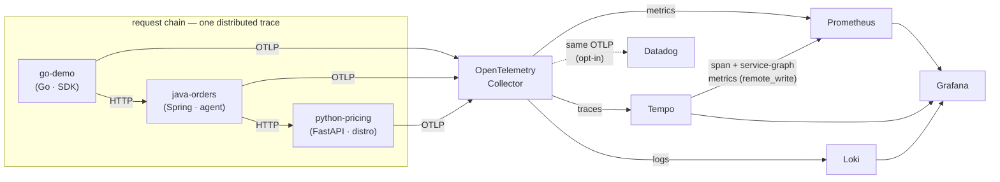
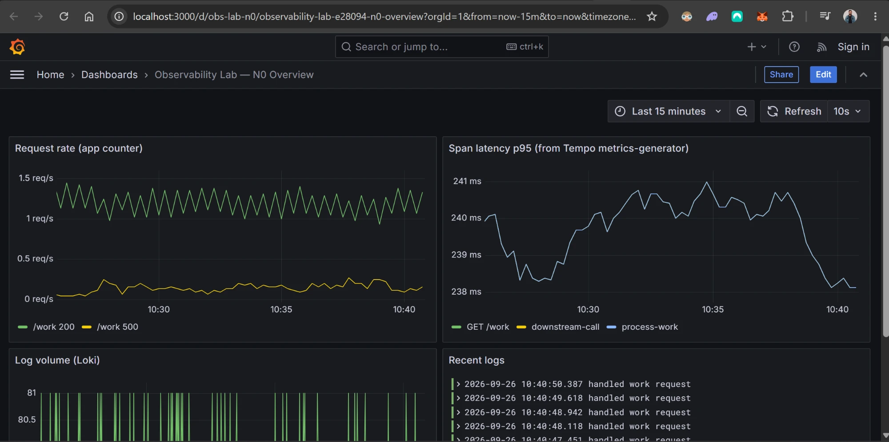
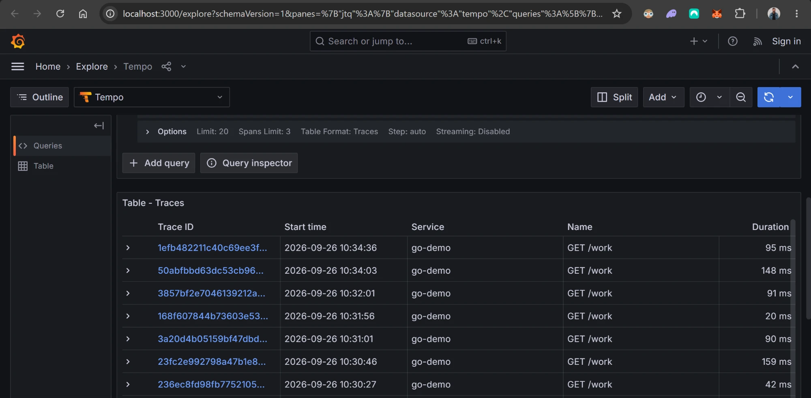
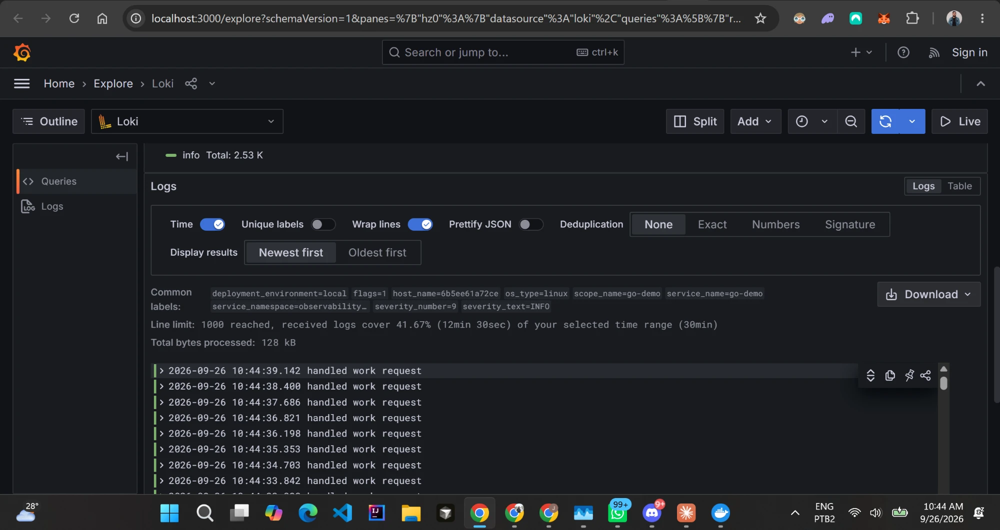

# Observability Lab

[](https://github.com/italo-gouveia/observability-lab/actions/workflows/ci.yml)
[](LICENSE)

A self-hosted, Docker-based observability platform built as a **learnable journey**.
Each level is a self-contained, runnable milestone — stop at any one and you already
have a strong project. The foundation is **OpenTelemetry**: a single instrumentation
standard whose telemetry fans out to open-source and commercial backends without
touching application code.

> **N0 (this level) is done and runs locally with one command.** Higher levels are the
> roadmap — see [The journey](#the-journey).

---

## N0 — Core & polyglot (current)

Three services in **three languages** — Go, Java and Python — form a request chain and
each emits **traces, metrics, and logs** over OTLP to an OpenTelemetry Collector, which
routes every signal to its backend. Grafana ships pre-provisioned with all three
datasources wired together (trace ↔ log ↔ metric correlation).



**Why polyglot:** a single `/work` request flows `go-demo → java-orders → python-pricing`
and shows up as **one trace spanning all three languages** in Tempo, proving OpenTelemetry's
cross-language context propagation (W3C `traceparent`). Go uses the OTel SDK; Java is
auto-instrumented by the **OTel Java agent**; Python by the **opentelemetry-distro** — none
of them share code. go-demo drives itself with synthetic load (with ~8% injected failures
that surface as error traces across all three), so dashboards and the service graph populate
on boot. Tempo's metrics-generator derives RED metrics and the service graph from the spans.

### Run it

```bash
docker compose up --build
```

| Service        | Has a web UI? | Where to open it                                                     |
|----------------|---------------|---------------------------------------------------------------------|
| Grafana        | ✅ yes        | http://localhost:3000 — anonymous admin; the N0 dashboard auto-loads |
| Prometheus     | ✅ yes        | http://localhost:9090 — targets under **Status → Targets**           |
| go-demo (edge) | — (endpoints) | http://localhost:8080/work drives the chain · `/healthz`             |
| java-orders    | — (endpoints) | http://localhost:8081/orders · `/healthz`                           |
| python-pricing | — (endpoints) | http://localhost:8082/price · `/healthz`                           |
| Tempo          | ❌ no UI      | traces backend — **query via Grafana → Explore → Tempo** (TraceQL)   |
| Loki           | ❌ no UI      | logs backend — **query via Grafana → Explore → Loki** (LogQL)        |

> **Tempo and Loki have no homepage.** Opening `http://localhost:3200` or `:3100`
> directly returns **404** — that is expected. They are API backends you query
> *through Grafana*, not websites. To check they are up, hit their health endpoints
> instead: `curl http://localhost:3100/ready` and `curl http://localhost:3200/ready`
> (both return `ready` once warmed up, ~15s after start).

Open **Grafana → Dashboards → "Observability Lab — N0 Overview"** for request rate,
p95 span latency, and live logs. In **Explore**, jump from a Tempo trace straight to its
logs in Loki (correlation is provisioned).

### Optional: Datadog

The same OTLP telemetry can fan out to a **commercial backend** with zero app
changes — the collector just gains one more exporter. This is **opt-in** so the
default stack needs no Datadog account:

```bash
cp .env.example .env    # set DD_API_KEY (and DD_SITE if you're not on US1)
docker compose -f docker-compose.yml -f docker-compose.datadog.yml up --build
```

The overlay swaps the collector to [`config-with-datadog.yaml`](otel-collector/config-with-datadog.yaml),
which adds a `datadog` exporter to the traces, metrics and logs pipelines alongside
Tempo/Prometheus/Loki. Traces then appear in Datadog **APM** and metrics under
`demo_*`. Your key stays in `.env` (git-ignored) — never committed.

---

## Screenshots

**N0 overview dashboard** — request rate (200s vs the ~10% synthetic 500s), p95 span
latency derived from traces by Tempo's metrics-generator, log volume and live logs, all
on a single pane:



**Traces in Tempo** — every `/work` request captured end to end (Grafana → Explore → Tempo):



**Logs in Loki** — structured logs carrying OpenTelemetry resource labels
(`service_name`, `severity_text`, `deployment_environment`), correlated back to traces:



## The journey

| Level | Theme              | Adds                                                                 |
|-------|--------------------|----------------------------------------------------------------------|
| **N0** | Core              | OTel Collector · Prometheus · Grafana · Loki · Tempo · (Datadog)     |
| N1     | Tracing & alerting | Jaeger/Zipkin · AlertManager + PagerDuty/OpsGenie · Blackbox exporter |
| N2     | Distributed system | Kafka/Redpanda · RabbitMQ · Redis · Postgres exporters · resilience4j |
| N3     | Logs & data        | Elastic/Kibana · Vector · Neo4j (service dependency graph)            |
| N4     | K8s & SRE          | k3s · kube-state-metrics/node-exporter/cAdvisor · Helm · Sloth (SLOs) |
| N5     | Advanced           | Service mesh (Istio/Linkerd) · eBPF (Beyla) · Pyroscope · chaos eng.  |
| N6     | GitOps & IaC       | Terraform · Ansible · ArgoCD · Vault · Keycloak (OIDC on Grafana)     |

Planned: extend the demo into a **polyglot** trio (Go + Java + Python) to showcase
OpenTelemetry's cross-language story.

Progress is tracked as a board in **[ROADMAP.md](ROADMAP.md)** — per-level checklists
for everything above.

---

## Layout

```
docker-compose.yml          # the whole N0 stack
otel-collector/config.yaml  # OTLP in; Prometheus/Tempo/Loki out
prometheus/prometheus.yml    # scrape config + remote-write receiver
tempo/tempo.yaml             # traces + metrics-generator (RED, service graph)
loki/loki-config.yaml        # single-binary Loki with native OTLP ingest
grafana/provisioning/        # datasources (correlated) + dashboard provider
grafana/dashboards/          # N0 overview dashboard
apps/go-demo/                # instrumented Go service (traces + metrics + logs)
```

## Tech proven at N0

OpenTelemetry · OTel Collector · Prometheus · Grafana · Loki · Tempo · Docker Compose ·
Go · (optional) Datadog.
